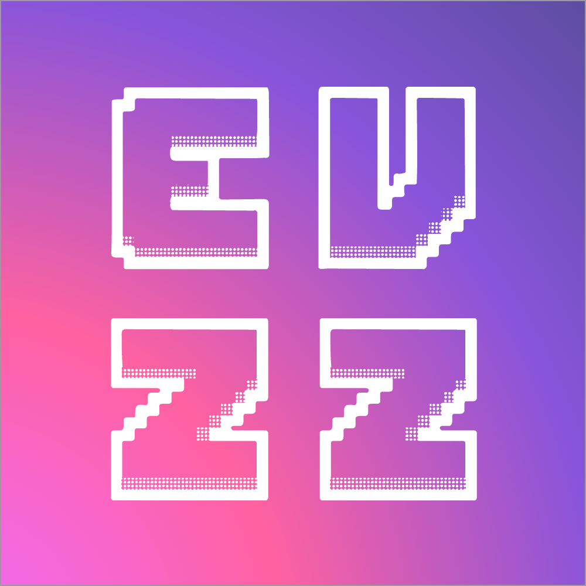

<table>
    <tr>
        <td>
            <h1>Elchin Zakizadeh</h1>
            <h3>💻 Full-Stack Web developer</h3>
            <h3>💛 JavaScript lover</h3>
            <h3>🌈 UI Designer (when forced)</h3>
            <h3>🚀 Beginner-level entrepreneur</h3>
            <h3>🌄 Adventure seeker</h3>
            <h3>👌 Always perfect</h3>
        </td>
        <td>
            
        </td>
    </tr>
</table>

